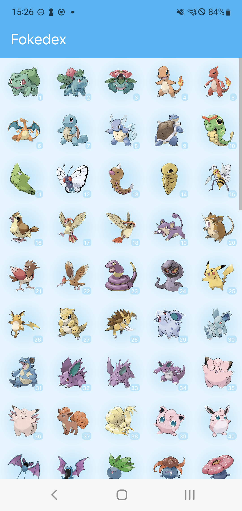
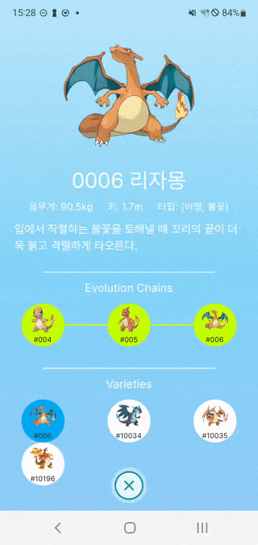

# Fokedex  
* Flutter 버전 포켓몬 도감 ([Compose 버전](https://github.com/SunChulBaek/Cokedex))
* Library
  * 상태관리 : [provider](https://pub.dev/packages/provider)
  * DI : [injectable](https://pub.dev/packages/injectable)
  * Network : [retrofit](https://pub.dev/packages/retrofit)
  * Database : [floor](https://pub.dev/packages/floor)
  * UI
    * [cached_network_image](https://pub.dev/packages/cached_network_image)
    * [infinite_scroll_pagination](https://pub.dev/packages/infinite_scroll_pagination)
  * 그밖에
    * [build_runner](https://pub.dev/packages/build_runner)
    * [freezed](https://pub.dev/packages/freezed)
* Screenshots
  

      
  
